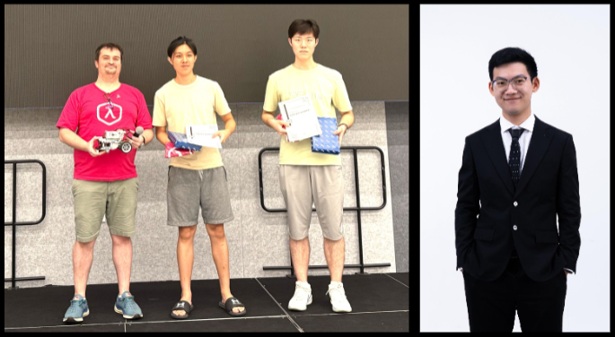
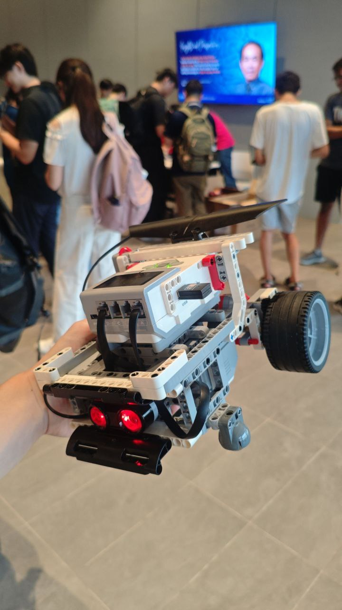

# CS1101S Sumobot, group Optimum Prime

NUS SoC 2025/2026 CS1101S Sumobot Contest Code

## Rules

Sumobots are Lego Mindstorm robots that are placed at 2 ends of the Dohyō, a 140 cm wide circle containing 7 concentric circles of different colors.

The objective of the tournament is to push your opponent's Sumobot out of the ring. Teams have access to a variety of sensors, such as:

* IR sensors
* Light sensors
* Color sensors
* Buttons

[Dohyo](./images/dohyo.png)

The team's robot is expected to **run autonomously** once the match has started.

[More Details about the Rules](https://docs.google.com/document/d/1gJDufBuj2HXPHSgPBAmPRw5\_167x86QxFkUvm-XeXcY/edit?tab=t.0#heading=h.gjdgxs)

## Images

Here's our team!

Our robot:

